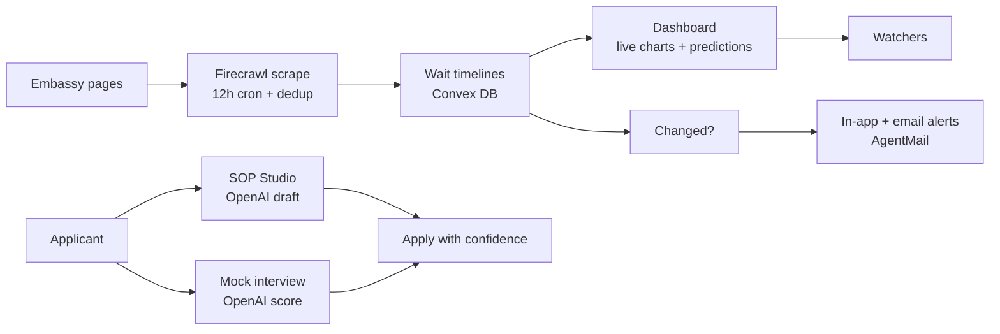
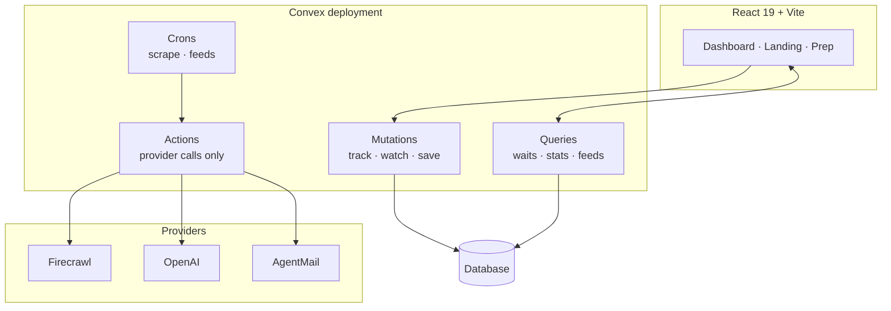

# VRADR — Visa Wait Tracker

[](https://github.com/BANKOLEDO/vradr/actions)

Real-time global visa wait dashboard. Personalized by home country, fed by embassy scrapes, with AI predictions, SOP drafting, mock interviews, and email alerts.

- **Live app:** https://wry-buffalo-825.convex.site
- **Demo video:** _coming soon_

## Stack

| Layer | Choice | What it does here |
| --- | --- | --- |
| Frontend | React 19, Vite, Tailwind v4, Heroicons | Dashboard, landing, auth pages |
| Backend | Convex (queries, mutations, actions, crons, auth) | Live data, tracking, scheduling |
| AI | OpenAI gpt-4o-mini | Wait predictions, SOP drafts, interview scoring, document reviews |
| Data | Firecrawl v2 scrape API | Embassy scrapes, feed discovery, listing rechecks |
| Email | AgentMail REST API | Welcome, reminders, and wait-change alerts from the app inbox |

## How it flows



## Architecture



## Go live (convex.site hosting)

```bash
npx convex login
pnpm deploy:live   # backend + frontend to your .convex.site URL
```

Set provider keys in the Convex dashboard env settings first (same names as
`.env.local`). The frontend auto-connects: `VITE_CONVEX_URL` when set, otherwise
the hosting deployment's own backend.

## Run locally

Prereqs: Node 18+, pnpm.

```bash
pnpm install
npx convex dev        # backend on http://127.0.0.1:3210
pnpm dev              # frontend on http://localhost:5173
```

Seed data (in a second terminal once Convex is up):

```bash
npx convex run seed:seed
npx convex run seed:seedFeeds
npx convex run opportunities:seedOpportunities
```

## Env vars (Convex dashboard or `.env.local` for Convex)

| Var | Needed for |
| --- | --- |
| `FIRECRAWL_API_KEY` | Embassy + feed scrapes |
| `OPENAI_API_KEY` | AI wait predictions, SOP Studio, mock interviews |
| `OPENAI_BASE_URL` | Optional, defaults to `https://api.openai.com/v1` (swap to a gateway for dev) |
| `OPENAI_MODEL` | Optional, defaults to `gpt-4o-mini` |
| `AGENTMAIL_API_KEY` | Sending mail, alerts, welcome emails |
| `AGENTMAIL_INBOX_ID` | The app's own inbox address (all sends go out from here) |
| `AGENTMAIL_API_URL` | Optional, defaults to `https://api.agentmail.to` |

Without keys the app runs on seed data; key-gated features explain themselves in the UI.

## Zero-cost setup (no card)

- AI: create a free OpenRouter account, set `OPENAI_BASE_URL` to `https://openrouter.ai/api/v1`, `OPENAI_API_KEY` to your OpenRouter key, and `OPENAI_MODEL` to a free model (e.g. one ending in `:free`). Swap back to official OpenAI for demo traffic.
- Scrapes: Firecrawl's free signup credits cover dev and demo.
- Inbox: AgentMail's free tier covers the app's outbound onboarding and alert emails.

## Scripts

- `pnpm dev` — frontend
- `pnpm build` — production build
- `pnpm test` — backend integration tests (vitest + convex-test)
- `npx tsc --noEmit` — typecheck

## Layout

- `convex/` — schema, queries, mutations, actions, crons, HTTP routes
- `src/pages/` — Landing, Dashboard, AuthPage, Terms, Privacy, NotFound
- `src/components/` — shared UI
- `hackathon.md` — build log
